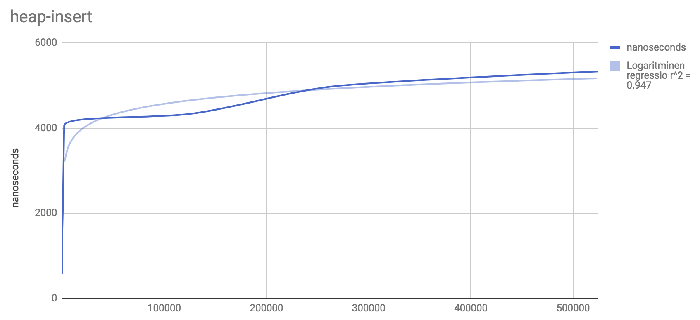

# Testausdokumentaatio

Tämä dokumentti sisältää testituloksia, kun olen testannut ja verrannut itse toteuttamiani tietorakenteita valmiisiin toteutuksiin.

## ArrayList

ArrayListiä on verrattu Javasta löytyvään ArrayListiin. Testisyötteenä on kokonaislukuja, joiden lukumäärä lisättynä listaan vaihtelee. Testit aloittavat yhdellä luvulla, sitten kaksi jne.. noudattaen kaavaa 2^n. Viimeinen testi lisää ArrayListiin hieman yli 8 miljoonaa lukua. Aika mitataan jokaisessa testitapauksessa ensimmäisen luvun lisäyksestä viimeisen luvun lisäykseen.

### insert()

Insert-operaation aikavaativuus on pahimmillaan O(n), sillä ArrayList-tietorakenne kasvattaa taulun kokoa dynaamisesti sitä mukaa, kun elementtejä lisätään listaan. Parhaimmillaan operaatio toimii vakioaikaisesti, eli sen parhaimman tapauksen aikavaativuus on O(1).

Testit on ajettu ottamalla keskiarvo 10 testiajosta.

| Lukujen määrä taulukossa |      Java        |     JavaScript           | JavaScript (ilman Object.seal ja fill)  |
| ------------- | ------------- |-------------| ------|
| 1 | ~0.0 ms | ~0.0 ms | ~0.0 ms |
| 2 | ~0.0 ms | ~0.0 ms | ~0.0 ms |
| 4 | ~0.0 ms | ~0.0 ms | ~0.0 ms |
| 8 | ~0.0 ms | ~0.0 ms | ~0.0 ms |
| 16 | ~0.0 ms | ~0.0 ms | ~0.0 ms |
| 32 | ~0.0 ms | ~0.0 ms | ~0.0 ms |
| 64 | ~0.0 ms | ~0.0 ms | ~0.0 ms |
| 128 | ~0.0 ms | ~0.0 ms | ~0.0 ms |
| 256 | ~0.0 ms | ~0.0 ms | ~0.0 ms |
| 512 | ~0.0 ms | ~0.0 ms | ~0.0 ms |
| 1024 | ~0.0 ms | ~0.0 ms | ~0.0 ms |
| 2048 | 0.2 ms | 1.2 ms | 0.1 ms |
| 4096 | 0.3 ms | 2.8 ms | 0.1 ms |
| 8192 | 0.3 ms | 5.9 ms | 0.2 ms |
| 16384 | 0.8 ms | 8.8 ms | 0.1 ms |
| 32768 | 0.6 ms | 22.9 ms | 0.2 ms |
| 65536 | 1.1 ms | 63.8 ms | 1.6 ms |
| 131072 | 2.5 ms | 108 ms | 3.1 ms |
| 262144 | 2.6 ms | 302 ms | 5.5 ms |
| 524288 | 9 ms | 760 ms | 11 ms |
| 1048576 | 14 ms | 1869.6 ms | 25 ms |
| 2097152 | 34 ms | 2945.6 ms | 190 ms |
| 4194304 | 74 ms | 17070 ms | 299 ms |
| 8388608 | 95 ms | 27855 ms | 2724 ms |

Ylläolevasta taulukosta voidaan huomata, että Javalla toteutettu ArrayList on suurin piirtein yhtä nopea kuin JavaScriptillä toteutettu ArrayList (Missä taulukkoa ei suljeta Object.seal -metodilla). Kuitenkin taulukon koon kasvaessa JavaScript-toteutus hidastuu merkittävästi vrt. Java -toteutukseen.

### get()

get() -metodi on vakioaikainen, joten sen testaamista en koe tarpeelliseksi.

## Heap (Keko)

Keon suorituskykytestit on ajettu ottamalla keskiarvo 10 testiajosta. Kekoon lisätään satunnaisesti generoituja lukuja. Tällöin heapify-operaatiota suoritetaan mahdollisimman tasaisesti.

Kuten huomataan, niin Javan ja JavaScriptin toteutukset ovat hyvin lähellä suoritusnopeudeltaan. Kuitenkin jos käytetään Object.seal ja fill -metodeja, niin keko hidastuu merkittävästi.

| Lukujen määrä keossa |      Java        |     JavaScript           | JavaScript (ilman Object.seal ja fill)  |
| ------------- | ------------- |-------------| ------|
| 1 | 0 ms | 0 ms | 0 ms |
| 2 | 0 ms | 0 ms | 0 ms |
| 4 | 0 ms | 0 ms | 0 ms |
| 8 | 0 ms | 0 ms | 0 ms |
| 16 | 0.1 ms | 0 ms | 0 ms |
| 32 | 0.1 ms | 0.2 ms | 0 ms |
| 64 | 0.1 ms | 0 ms | 0.1 ms |
| 128 | 0.1 ms | 0.3 ms | 0.3 ms |
| 256 | 0.2 ms | 0.2 ms | 0.2 ms |
| 512 | 0.1 ms | 0.3 ms | 0.1 ms |
| 1024 | 0.2 ms | 0.8 ms | 0.1 ms |
| 2048 | 0.2 ms | 0.8 ms | 0.2 ms |
| 4096 | 0.2 ms | 2.6 ms | 0.3 ms |
| 8192 | 0.3 ms | 6.6 ms | 0.6 ms |
| 16384 | 1.2 ms | 7.8 ms | 1.1 ms |
| 32768 | 1.6 ms | 22.1 ms | 2.6 ms |
| 65536 | 7.1 ms | 31 ms | 4.4 ms |
| 131072 | 8.4 ms | 106.5 ms | 8.6 ms |
| 262144 | 12.4 ms | 314.3 ms | 19.2 ms |
| 524288 | 33.4 ms | 463.8 ms | 31.7 ms |
| 1048576 | 79.3 ms | 1247.3 ms | 73.2 ms |
| 2097152 | 103.7 ms | 3418.4 ms | 176.6 ms |
| 4194304 | 211 ms | 4332.6 ms | 267.1 ms |
| 8388608 | 426.8 ms | 11955.9 ms | 568.2 ms |
| 16777216 | 1789 ms | - ms | 3295.3 ms |

Kekoa testattaessa on otettava huomioon se, että Comparatorin toiminta vaikuttaa heap-insert ja heap-del-min -metodien aikavaativuuteen. Oletetaan, että meillä on käytössä Comparator, mikä lajittelee luvut pienimmästä suurimpaan. Jos kekoon lisätään nyt lukuja käänteisessä järjestyksessä, niin n kappaletta lukuja lisätessä aikaa kuluu n * log(n). Jos taas lukuja poistetaan keosta, niin tällöin aikaa kuluu myös keskimäärin n * log(n). 

Testasin keon operaatioiden aikavaativuuden siten, että lisäsin kekoon ensin miljoonia lukuja käänteisessä järjestyksessä ja mittasin siihen kuluvan ajan. Tämän jälkeen poistin keosta kaikki luvut, josta otin myös ylös siihen kuluneen ajan. Ajoin tätä muutaman tuhat kertaa läpi, ja joka kierroksen lopussa jaoin lisäykseen kuluneen ajan poistoon kuluneen ajan. Tämä suhde konvergoituu luvun 1.00 lähelle, joten voidaan sanoa että tätä testaustekniikkaa käyttämällä heapify-operaation tasainen kutsunta kertoo lisäys- ja poisto-operaatioiden toimivan aikavaativuudella O(log n).

Lukuja lisätessä kekoon satunnaisesti insert toimii nyt epävakaammin: heapify-operaatiota kutsutaan n. 50% ajasta. Insertin aikavaativuus on siis O(1):n ja O(log n):n välissä, mutta poisto-operaation aikavaativuus on edelleen O(log n).
Lisäykseet suoritettiin nyt huomattavasti nopeammin kuin poistot.

Allaolevassa kuvassa on lisätty ensin n-1 lukua, jonka jälkeen viimeinen heap-insert -metodi toimii ajassa O(log n). Regressio saatiin suoraan toimimaan yllättävän hyvin.

