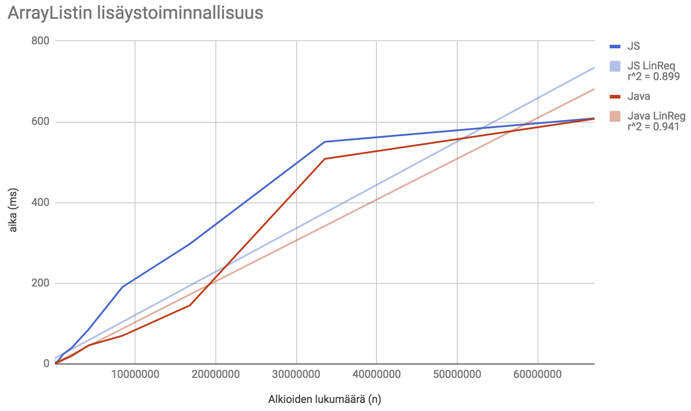
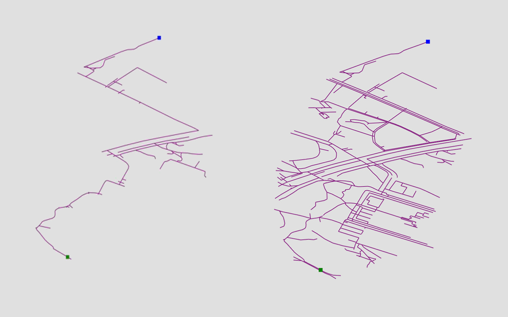

# Testausdokumentaatio

Tämä dokumentti sisältää testituloksia, kun olen testannut ja verrannut itse toteuttamiani tietorakenteita valmiisiin toteutuksiin.

Tietorakenteille on toteutettu yksikkötestejä, jotka suoritetaan käyttämällä ```mocha-typescript``` -kirjastoa. Codecov-palvelu pitää huolta rivikattavuuden tarkistamisesta.

Testit suoritetaan komennolla ```yarn test```.

## ArrayList

ArrayListiä on verrattu Javasta löytyvään ArrayListiin. Testisyötteenä on kokonaislukuja, joiden lukumäärä lisättynä listaan vaihtelee. Testit aloittavat yhdellä luvulla, sitten kaksi jne.. noudattaen kaavaa 2^n. Viimeinen testi lisää ArrayListiin hieman yli 8 miljoonaa lukua. Aika mitataan jokaisessa testitapauksessa ensimmäisen luvun lisäyksestä viimeisen luvun lisäykseen.

### insert()

Insert-operaation aikavaativuus on pahimmillaan O(n), sillä ArrayList-tietorakenne kasvattaa taulun kokoa dynaamisesti sitä mukaa, kun elementtejä lisätään listaan. Parhaimmillaan operaatio toimii vakioaikaisesti, eli sen parhaimman tapauksen aikavaativuus on O(1).

Testit on ajettu ottamalla keskiarvo 10 testiajosta.

| Lukujen määrä taulukossa |      Java        |     JavaScript           | JavaScript (ilman Object.seal ja fill)  |
| ------------- | ------------- |-------------| ------|
| 1 | ~0.0 ms | ~0.0 ms | ~0.0 ms |
| 2 | ~0.0 ms | ~0.0 ms | ~0.0 ms |
| 4 | ~0.0 ms | ~0.0 ms | ~0.0 ms |
| 8 | ~0.0 ms | ~0.0 ms | ~0.0 ms |
| 16 | ~0.0 ms | ~0.0 ms | ~0.0 ms |
| 32 | ~0.0 ms | ~0.0 ms | ~0.0 ms |
| 64 | ~0.0 ms | ~0.0 ms | ~0.0 ms |
| 128 | ~0.0 ms | ~0.0 ms | ~0.0 ms |
| 256 | ~0.0 ms | ~0.0 ms | ~0.0 ms |
| 512 | ~0.0 ms | ~0.0 ms | ~0.0 ms |
| 1024 | ~0.0 ms | ~0.0 ms | ~0.0 ms |
| 2048 | 0.2 ms | 1.2 ms | 0.1 ms |
| 4096 | 0.3 ms | 2.8 ms | 0.1 ms |
| 8192 | 0.3 ms | 5.9 ms | 0.2 ms |
| 16384 | 0.8 ms | 8.8 ms | 0.1 ms |
| 32768 | 0.6 ms | 22.9 ms | 0.2 ms |
| 65536 | 1.1 ms | 63.8 ms | 1.6 ms |
| 131072 | 2.5 ms | 108 ms | 3.1 ms |
| 262144 | 2.6 ms | 302 ms | 5.5 ms |
| 524288 | 9 ms | 760 ms | 11 ms |
| 1048576 | 14 ms | 1869.6 ms | 25 ms |
| 2097152 | 34 ms | 2945.6 ms | 190 ms |
| 4194304 | 74 ms | 17070 ms | 299 ms |
| 8388608 | 95 ms | 27855 ms | 2724 ms |

Ylläolevasta taulukosta voidaan huomata, että Javalla toteutettu ArrayList on suurin piirtein yhtä nopea kuin JavaScriptillä toteutettu ArrayList (Missä taulukkoa ei suljeta Object.seal -metodilla). Kuitenkin taulukon koon kasvaessa JavaScript-toteutus hidastuu merkittävästi vrt. Java -toteutukseen.

Allaoleva kaavio vertailee Javan ja JavaScriptin toteutuksia keskenään. Lineaarisen regression korrelaatiokertoimesta voidaan päätellä, että add() -operaatio toimii aikavaativuudella O(n). Satunnaiset piikit johtuvat siitä, että taulukko täyttyy ja taulukon kokoa joudutaan kasvattamaan dynaamisesti.



### get()

get() -metodi on vakioaikainen, joten sen testaamista en koe tarpeelliseksi.

## Heap (Keko)

Keon suorituskykytestit on ajettu ottamalla keskiarvo 10 testiajosta. Kekoon lisätään satunnaisesti generoituja lukuja. Tällöin heapify-operaatiota suoritetaan mahdollisimman tasaisesti.

### heapDelMin() ja heapInsert()

Kekoa testattaessa on otettava huomioon se, että Comparatorin toiminta vaikuttaa heapInsert(obj: T) ja heapDelMin() -metodien aikavaativuuteen. Oletetaan, että meillä on käytössä Comparator, mikä lajittelee luvut pienimmästä suurimpaan. Jos kekoon lisätään nyt lukuja käänteisessä järjestyksessä, niin n kappaletta lukuja lisätessä aikaa kuluu n * log(n). Jos taas lukuja poistetaan keosta, niin tällöin aikaa kuluu myös keskimäärin n * log(n). 

Testasin keon heapInsert ja heapDelMin -metodien aikavaativuuden siten, että lisäsin kekoon ensin miljoonia lukuja käänteisessä järjestyksessä ja mittasin siihen kuluvan ajan. Tämän jälkeen poistin keosta kaikki luvut, josta otin myös ylös siihen kuluneen ajan. Ajoin tätä muutaman tuhat kertaa läpi, ja joka kierroksen lopussa jaoin lisäykseen kuluneen ajan poistoon kuluneen ajan. Tämä suhde konvergoituu luvun 1.00 lähelle, joten voidaan sanoa että tätä testaustekniikkaa käyttämällä heapify-operaation tasainen kutsunta kertoo lisäys- ja poisto-operaatioiden toimivan aikavaativuudella O(log n).

Lukuja lisätessä kekoon satunnaisesti insert toimii nyt epävakaammin: heapify-operaatiota kutsutaan n. 50% ajasta. Insertin aikavaativuus on siis O(1):n ja O(log n):n välissä, mutta poisto-operaation aikavaativuus on edelleen O(log n).
Lisäykseet suoritettiin nyt huomattavasti nopeammin kuin poistot.

Allaolevassa kuvassa on lisätty ensin n-1 lukua, jonka jälkeen viimeinen heap-insert -metodi toimii ajassa O(log n). Regressio saatiin suoraan toimimaan yllättävän hyvin.


### get()

Koska minimikeko on toteutettu taulukolla ja halutaan hakea objekti jostain taulukon indeksistä, on sen hakeminen vakioaikainen O(1). En kokenut tämän metodin testaamista käytännölliseksi, koska metodi suoriutuu vakioajassa.

# Dijkstran algoritmi

Dijkstran algoritmin testaukseen on käytetty itse toteutettuja verkkoja. Etäisyydet on laskettu käsin ja on varmistettu, että ne on laskettu oikein. Verrattuna A*-algoritmiin Dijkstran algoritmi käy paljon enemmän solmuja läpi. Dijkstran algoritmin pahin aikavaativuus on O(|E] + |V|log|V]), joka alkaa tuntumaan suuria verkkoja käytettäessä.

# AStar-algoritmi

Koska AStar-algoritmi pohjautuu Dijkstran algoritmiin, on testauksessa käytetty samoja verkkoja kuin Dijkstran algoritmissä. Heuristiikkafunktioita on olemassa kaksi: etäisyys maaliin ja (etäisyys maaliin + etäisyys alkuun). On havaittu, että heuristiikkafunktio, mikä laskee pelkästään etäisyyden maaliin, on parempi algoritmin kannalta. Algoritmin suoritusaika on nopeampi tällä heuristiikkafunktiolla, mikä ilmenee allaolevasta kuvasta:

Vasemmalla: pelkkä etäisyys maaliin, oikealla: etäisyys maaliin + etäisyys alkuun



Kuvasta voi myös huomata, miten nätisti A* algoritmi "kääntyy" maalia kohden. Aivan kuin alku- ja loppupisteiden väliin piirtyisi ellipsi.

Repositoriosta löytyy JSON-tiedosto, joka sisältää yli 200000 solmua sisältävän verkon. Vaikka Front-end ei pysy Dijkstran algoritmin tahdissa (Sivu jäätyy, kun on piirretty n. 20000 kaarta) A* algoritmi suoriutuu lyhimmän reitin etsinnästä todella vikkelästi.

Tästä voidaan tulkita, että oikean heuristiikkafunktion kanssa A* joutuu käymään murto-osan kaaria läpi verrattuna Dijkstran algoritmiin, joten algoritmin suoritusaika on nopeampi, keskimäärin luokkaa O(|E]), missä |E| on kaarien lukumäärä.


# BFS-algoritmi

BFS-algoritmiä on testattu erikokoisilla verkoilla. Testaus on sinänsä triviaalia, sillä kaaripainojen oletetaan olevan vakioita.